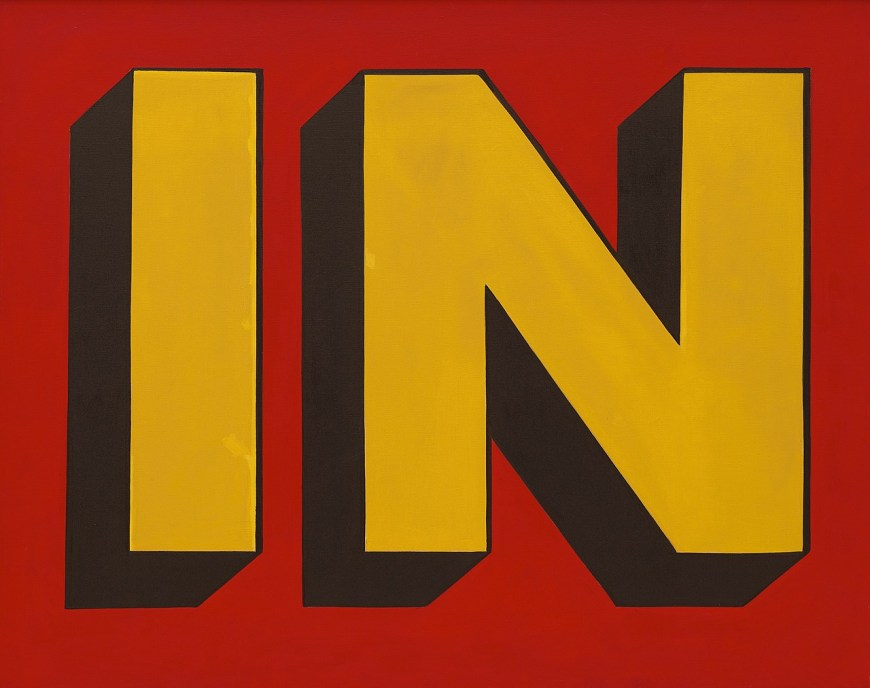

Margins, padding, and borders are similar in that they all determine how much space is taken up. Margins are the spaces between the outer edge of the border out. Padding is the space between the inner content and the inner edge of a border. Border are the place holder.

I feel so good about this one! I was able to go step by step and everything made sense!
